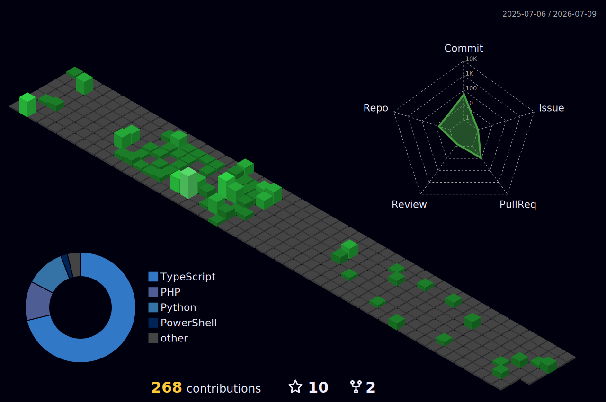

<h1 align="center">
    
</h1>

<h3 align="center">A committed software developer from Brasil ᵇʳ</h3> 

 
 🔭 I’m currently working on **My Portifolio**
 
 🌱 I’m currently learning **Python**

💬 Ask me about **Node.js, React... or anything [here](https://github.com/gusata/gusata/issues)**

⚡ Fun fact **I'm launching a clothing brand named Zwear. Take a Look on our [Instagram](https://www.instagram.com/_zwear__/)** 

 

 

 
  
  
 <!-- <a href="https://salesp07.github.io" target="_blank"> 
     --> 
  </a>

 
<h2 align="center">⚒️ Languages-Frameworks-Tools ⚒️</h2>

 

    
     

 

<h1 align="center">
    
</h1>

